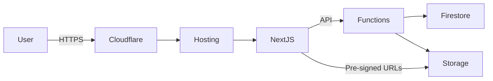

# Architecture Overview

Gloomy is a Next.js 14 application deployed on Firebase Hosting with backend integrations across Firebase services and Cloudflare.

## High-Level Flow

1. **Web client (Next.js / React)** renders catalogue and QuickDrop UIs. Public routes are statically optimised while authenticated admin views rely on server-side rendering.
2. **Firebase Hosting** serves the Next.js build and proxies dynamic API routes to the regional Firebase Functions backend.
3. **Cloud Functions (frameworks backend)** handle authenticated operations such as catalogue mutations, token validation, and QuickDrop orchestration.
4. **Firestore** stores catalogue metadata, QuickDrop documents, audit log entries, and user roles.
5. **Cloud Storage** hosts binary payloads for catalogue downloads and temporary QuickDrop uploads; access is mediated through signed URLs.
6. **Cloudflare** fronts the hosting site for caching, rate limiting, and managed challenge enforcement on upload surfaces.

## Key Components

- **App routes (`app/`)**: Public catalogue, download flows, QuickDrop UI, and admin console.
- **API routes (`app/api/`)**: Generate signed URLs, enforce password gating, and mediate QuickDrop link lifecycle.
- **Rate limiting (`lib/quickdrop/rate-limit.ts`)**: Hashes client identifiers and throttles QuickDrop initialisations per IP window.
- **Firebase Admin layer (`lib/firebase/admin.ts`)**: Boots server-side SDK with least-privilege credentials.
- **Security rules (`firestore.rules`, `storage.rules`)**: Govern client-side access for both catalogue viewers and anonymous QuickDrop uploads.
- **Cleanup utilities (`lib/quickdrop/admin.ts`)**: Purge expired or abandoned QuickDrop documents and their storage payloads.

## Deployment Pipeline

GitHub Actions trigger on pull requests and merges:

- `firebase-hosting-pull-request.yml` builds preview channels for QA.
- `firebase-hosting-merge.yml` deploys the production site (`channelId: live`) once tests/build succeed.
  - Workflow environment variables set `FIREBASE_CLI_EXPERIMENTS=webframeworks`.
  - Service account `github-action-916905548@gloomy-63e37.iam.gserviceaccount.com` holds Hosting, Functions, Auth, Extensions, and Storage privileges.

## Configuration Artifacts

- `.env.local` for local development Firebase config and secrets.
- `firebase.json` for hosting + emulator settings.
- `REWRITE_PLAN.md` tracks major architectural milestones.
